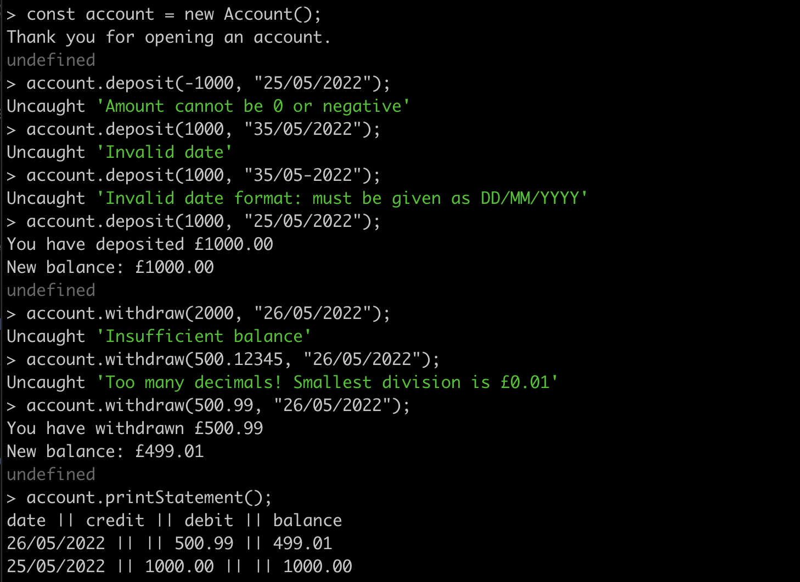

# Bank Tech Test

This is a tech test for the Makers main course written in Javascript which simulates a bank account that has a balance, can deposit money, can withdraw money and print its statement.

Miro planning board [here](https://miro.com/app/board/uXjVOzM9MG8=/?share_link_id=305314712727)

## Getting Started

## How To Use

While in the [main](https://github.com/jmcnally17/bank-tech-test) directory, change to the [src](https://github.com/jmcnally17/bank-tech-test/tree/main/src) directory using `cd src` and then run the [account.js](https://github.com/jmcnally17/bank-tech-test/blob/main/src/account.js) file in Node.js REPL:

```
node
.load account.js
```

The terminal being in the src directory is necessary so that the require statements in account.js for both the [TransactionLog](https://github.com/jmcnally17/bank-tech-test/blob/main/src/transactionLog.js) and [Statement](https://github.com/jmcnally17/bank-tech-test/blob/main/src/statement.js) classes work correctly.

Once the file has loaded, a new account can be created and updated with the following commands:

```
const account = new Account();
account.deposit(amount, date);
account.withdraw(amount, date);
```

The deposit and withdraw functions increase and decrease the balance of the account respectively and are added into the history of the transaction log. These functions both have the following requirements for their arguments passed:

* amount:
  * must be a number
  * cannot be less than or equal to 0
  * cannot have more than two decimal places (since it is in units of pounds)
  * cannot be greater than the balance (this only applies to withdraw)
* date:
  * must be in a valid format (DD/MM/YYYY)
  * must be a valid date

If any of these conditions are not met, then the program will throw an appropriate error, giving the user some insight into what was wrong with their input.

At any point, the accounts balance and statement can be printed to the console using:

```
account.displayBalance();
account.printStatement();
```

This will display the balance in a simple readable print:

```
Balance: £2500.00
```

The statement will show every transaction from most recent to oldest in the format:

```
date || credit || debit || balance
14/01/2023 || || 500.00 || 2500.00
13/01/2023 || 2000.00 || || 3000.00
10/01/2023 || 1000.00 || || 1000.00
```

Transactions with a non-zero amount of money in the credit column are deposits while transactions with a non zero amount of money in the debit column are withdrawals. The balance displayed is the balance of the account once the transaction has been completed.

The user is able to enter dates they want in any order. This could therefore create confusion in the statement with transactions being unordered. In the real world, the program would simply record the current date when a transaction is made (could be done by simply using `new Date()`). However, this program has been designed with the intent for the user to use this on a short timescale. Therefore, forcing the user to use the current date would mean they could only record transactions one day at a time which would be a major inconvenience for testing this program.

### Example Output



## Testing
