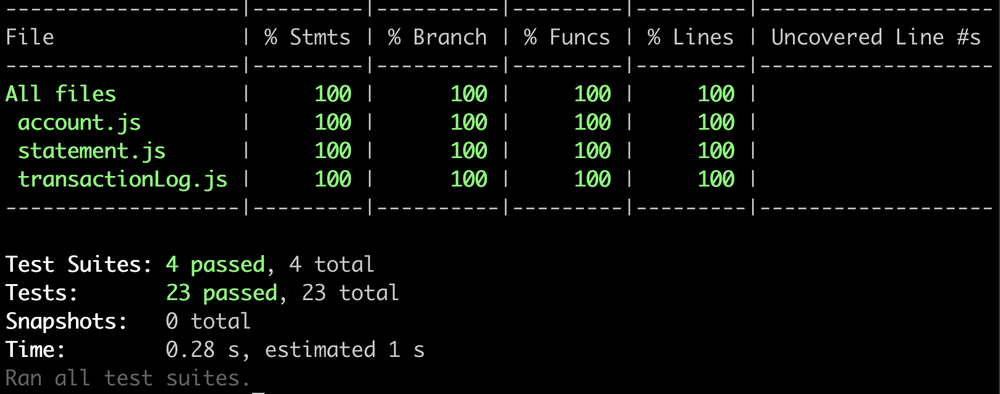

# Bank Tech Test

This is a tech test for the Makers main course written in Javascript which simulates a bank account that has a balance, can deposit money, can withdraw money and print its statement. This program has been made while adhering to the following principles:
  * [Object Oriented Programming](https://en.wikipedia.org/wiki/Object-oriented_programming) (OOP)
  * [Test Driven Development](https://en.wikipedia.org/wiki/Test-driven_development) (TDD)
  * [Single Responsibility Principle](https://en.wikipedia.org/wiki/Single-responsibility_principle) (SRP)
  * [Don't Repeat Yourself](https://en.wikipedia.org/wiki/Don%27t_repeat_yourself) (DRY) code

Technologies used:
  * [Miro](https://miro.com/) for planning. Board can be found [here](https://miro.com/app/board/uXjVOzM9MG8=/?share_link_id=305314712727)
  * [Jest](https://jestjs.io/) for unit testing.
  * The VS Code extension [Prettier](https://marketplace.visualstudio.com/items?itemName=esbenp.prettier-vscode) for linting.

## Approach

I started off by creating a Miro board to map out my idea of how the program would work and what classes I would be creating. I initially created my user stories that I thought covered the functionality I wanted to implement. I then started with the Account class that contained a balance instance variable in the constructor and five functions that would fulfill these user stories:
  * getBalance()
  * displayBalance()
  * deposit(amount, date)
  * withdraw(amount, date)
  * printStatement()

*Note: Although getBalance technically already deals with showing the balance of the account, I created displayBalance to print a more user-friendly message to the console.*

I then started to think about how each function would work and what each would need in order to carry out their responsibility. getBalance and displayBalance were very straightforward since all they required was just the balance instance variable. Initially, deposit and withdraw would simply increase and decrease the balance respectively; however, I quickly realised printStatement would rely on all transactions being recorded in a log so that it could pull that data to format it into a statement. Therefore, it became clear that deposit and withdraw would need to add the current transaction to this log once they update the balance.

At this point I could see the Account class had more than one responsibility. Therefore, I looked at what I had planned so far and saw there were three main responsibilities:
  * Monitoring the balance
  * Keeping a history of all previous transactions
  * Creating a statement from the transaction log

It was clear two more classes were needed in order to adhere to the SRP: TransactionLog and Statement. I then followed the same process for these two classes as I had for the account class.

Each transaction would need four keys:
  * type - which column to put the amount under
  * amount - the change in the balance the transaction would make
  * date - when the transaction was made
  * balance - the updated balance once the transaction is completed

These were made into a Javascript object by the transaction log and then added into the history instance variable. The Statement class would need to have one function using the transaction log as an argument to obtain the array of transaction objects. It would then iterate through this array and format each transaction into a string that can be added to the statement.

I then had to plan how I would connect these classes together. I decided to use dependency injection to create an instance of the TransactionLog and Statement classes in the constructor of the Account class because one account would have one corresponding transation history and statement.

Next, I tackled edge cases which all turned out to be solved by simply throwing errors when certain conditions are met with the user's input (e.g. invalid dates being entered).

Finally, to finish planning I drew up an example of what output I wanted to see when running the code in Node.js REPL. This was a good way of remembering what output messages I wanted my functions to give.

At this point, I thought I had sufficiently planned and begun to write code, with tests being run first to adhere to TDD. 

## Getting Started

This program is run using Node.js, which is installed using NVM - Node Version Manager. So, if you haven't already, install NVM using:

```
curl -o- https://raw.githubusercontent.com/nvm-sh/nvm/v0.39.1/install.sh | bash
```

Now, your ~/.zshrc file will need reloading:

```
source ~/.zshrc
```

Next, you can install and start using node by running:

```
nvm install node
nvm use node
```

`nvm use node` will use the latest stable version. Once that is set up, you can now clone this repository and then install the necessary dependencies using:

```
git clone https://github.com/jmcnally17/bank-tech-test.git
npm install
```

`npm install` must be run while in the main directory.

Now you are all set up. Move onto the following section to learn how to use this program.

## How To Use

While in the [main](https://github.com/jmcnally17/bank-tech-test) directory, change to the [src](https://github.com/jmcnally17/bank-tech-test/tree/main/src) directory using `cd src` and then run the [account.js](https://github.com/jmcnally17/bank-tech-test/blob/main/src/account.js) file in Node.js REPL:

```
node
.load account.js
```

The terminal being in the src directory is necessary so that the require statements in account.js for both the [TransactionLog](https://github.com/jmcnally17/bank-tech-test/blob/main/src/transactionLog.js) and [Statement](https://github.com/jmcnally17/bank-tech-test/blob/main/src/statement.js) classes work correctly.

Once the file has loaded, a new account can be created and updated with the following commands:

```
const account = new Account();
account.deposit(amount, date);
account.withdraw(amount, date);
```

The deposit and withdraw functions increase and decrease the balance of the account respectively and are added into the history of the transaction log. These functions both have the following requirements for their arguments passed:

* amount:
  * must be a number
  * cannot be less than or equal to 0
  * cannot have more than two decimal places (since it is in units of pounds)
  * cannot be greater than the balance (this only applies to withdraw)
* date:
  * must be in a valid format (DD/MM/YYYY)
  * must be a valid date

If any of these conditions are not met, then the program will throw an appropriate error, giving the user some insight into what was wrong with their input.

At any point, the accounts balance and statement can be printed to the console using:

```
account.displayBalance();
account.printStatement();
```

This will display the balance in a simple readable print:

```
Balance: £2500.00
```

The statement will show every transaction from most recent to oldest in the format:

```
date || credit || debit || balance
14/01/2023 || || 500.00 || 2500.00
13/01/2023 || 2000.00 || || 3000.00
10/01/2023 || 1000.00 || || 1000.00
```

Transactions with a non-zero amount of money in the credit column are deposits while transactions with a non zero amount of money in the debit column are withdrawals. The balance displayed is the balance of the account once the transaction has been completed.

The user is able to enter dates they want in any order. This could therefore create confusion in the statement with transactions being unordered. In the real world, the program would simply record the current date when a transaction is made (could be done by simply using `new Date()`). However, this program has been designed with the intent for the user to use this on a short timescale. Therefore, forcing the user to use the current date would mean they could only record transactions one day at a time which would be a major inconvenience for testing this program.

### Example Output


## Testing

Jest was used to create the test suite for each class. To run the tests, simply enter `jest` into the terminal while in either the main or src directory. If you want to see the code coverage stats as well, then running `jest --coverage` will show them. Each test passes and provides a 100% code coverage with regards to each function and each line. The output from this is shown here:



*Note: The test coverage doesn't fully cover the branching. This is due to how the constructor works when injecting other classes into the account class.*

Tests were alway written first using the Red-Green-Refactor technique from TDD, with the simplest implementation to solve the tests being written first. Any code that needed to be changed was done so after its test had been updated first. This is so even when modifications are made to existing code, the Red-Green-Refactor technique is still followed.
