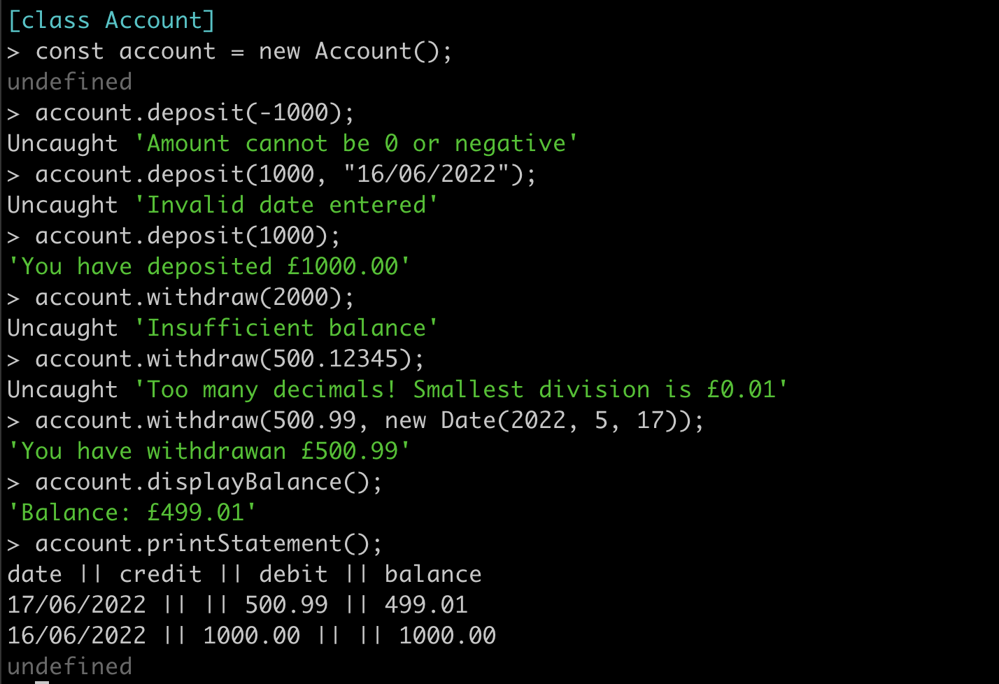

# Bank Tech Test

This is a tech test for the Makers main course written in Javascript which simulates a bank account that has a balance, can deposit money, can withdraw money and print its statement. This program has been made while adhering to the following criteria:

- [Object Oriented Programming](https://en.wikipedia.org/wiki/Object-oriented_programming) (OOP)
- [Test Driven Development](https://en.wikipedia.org/wiki/Test-driven_development) (TDD)
- [Single Responsibility Principle](https://en.wikipedia.org/wiki/Single-responsibility_principle) (SRP)
- [Don't Repeat Yourself](https://en.wikipedia.org/wiki/Don%27t_repeat_yourself) (DRY) code

Technologies used:

- [Miro](https://miro.com/) for planning. Board can be found [here](https://miro.com/app/board/uXjVOzM9MG8=/?share_link_id=305314712727)
- [Jest](https://jestjs.io/) for unit testing
- [ESLint](https://eslint.org/) for linting
- The VS Code extension [Prettier](https://marketplace.visualstudio.com/items?itemName=esbenp.prettier-vscode) for formatting README.md

## Getting Started

This program is run using Node.js, which is installed using NVM - Node Version Manager. So, if you haven't already, install NVM using:

```
curl -o- https://raw.githubusercontent.com/nvm-sh/nvm/v0.39.1/install.sh | bash
```

Now, your ~/.zshrc file will need reloading:

```
source ~/.zshrc
```

Next, you can install and start using node by running:

```
nvm install node
nvm use node
```

`nvm use node` will use the latest stable version. Once that is set up, you can now clone this repository and then install the necessary dependencies using:

```
git clone https://github.com/jmcnally17/bank-tech-test.git
npm install
```

`npm install` must be run while in the main directory.

Now you are all set up. Move onto the following section to learn how to use this program.

## How To Use

While in the [main](https://github.com/jmcnally17/bank-tech-test) directory, change to the [src](https://github.com/jmcnally17/bank-tech-test/tree/main/src) folder using `cd src` and then run [account.js](https://github.com/jmcnally17/bank-tech-test/blob/main/src/account.js) in Node.js REPL:

```
node
.load account.js
```

The terminal being in the src directory is necessary so that the require statements in account.js for both [transactionLog.js](https://github.com/jmcnally17/bank-tech-test/blob/main/src/transactionLog.js) and [statement.js](https://github.com/jmcnally17/bank-tech-test/blob/main/src/statement.js) work correctly.

Once the file has loaded, a new account can be created and updated with the following commands:

```
const account = new Account();
account.deposit(amount, date);
account.withdraw(amount, date);
```

`deposit()` and `withdraw()` increase and decrease the balance of the account respectively and call `addTransaction()` from `TransactionLog` to add the transaction to `this.history`. `withdraw()` cannot be run with an empty transaction log, because you cannot withdraw money from an empty account. The current balance is calculated from the transaction history itself. Therefore, no transaction history means there is no data to calculate a balance and thus £0.00 is given as the balance for this case. `date` has a default value which is a new Date object for the current time when `deposit()` and `withdraw()` are run. If you wish to input your own dates, however, the criteria for `date` is listed below along with the criteria for `amount`:

- `amount`:
  - must be a number
  - cannot be less than or equal to 0
  - cannot have more than two decimal places (since it is in units of pounds)
  - cannot be greater than the updated balance of the last transaction (this only applies to withdraw)
- `date`:
  - must be a valid date object (e.g. new Date(2022, 5, 26) is valid, new Date(2022, 5, 37) is invalid)

If any of these conditions are not met, then the program will throw an appropriate error, giving the user some insight into what was wrong with their input.

At any point, the accounts balance and statement can be printed to the console using:

```
account.displayBalance();
account.printStatement();
```

This will display the balance in a simple readable print:

```
Balance: £2500.00
```

The statement will show every transaction from most recent to oldest in the format:

```
date || credit || debit || balance
14/01/2023 || || 500.00 || 2500.00
13/01/2023 || 2000.00 || || 3000.00
10/01/2023 || 1000.00 || || 1000.00
```

Transactions with a non-zero amount of money in the credit column are deposits while transactions with a non zero amount of money in the debit column are withdrawals. The balance displayed is the balance of the account once the transaction has been completed.

Since the user is able to enter dates they want in any order, this could create confusion in the statement with transactions being unordered. However, the freedom to input a specific date for testing is needed which opens this option up for the user. To prevent this in the real world, a user interface would be made to stop the user from being able to input the date they wanted to and would instead always use the default value of `new Date()` to get the current date. Also, this program has been designed for users to experiment with multiple different dates in a short timescale, as oppose to entering transactions and having to wait a full day to input a new one with a different date.

### Example Output



## Testing

Jest was used to create the test suite for each class and the [feature test](https://github.com/jmcnally17/bank-tech-test/blob/main/src/feature.test.js). To run the tests, simply enter `npm run test` into the terminal while in either the main or src directory. If you want to see the code coverage stats as well, then running `npm run test:coverage` will show them. Each test passes and cumulatively provide a 100% code coverage. The output from this is shown here:


Tests were alway written first using the Red-Green-Refactor technique from TDD, with the simplest implementation to solve the tests being written first. Any code that needed to be changed was done so after its test had been updated first. This is so even when modifications are made to existing code, the Red-Green-Refactor technique is still followed.

Jest automatic mocks were also used where appropriate in order to isolate classes when testing.

## Approach

I started off by creating a Miro board to map out my idea of how the program would work and what classes I would be creating. I initially created my user stories that I thought covered the functionality I wanted to implement. I then started with the `Account` class that contained a balance instance variable in the constructor called `this.balance` and five functions that would fulfill these user stories:

- `getBalance()`
- `displayBalance()`
- `deposit(amount, date)`
- `withdraw(amount, date)`
- `printStatement()`

_Note: Although `getBalance()` already dealt with showing the balance of the account, I created `displayBalance()` to print a more user-friendly message to the console._

I then started to think about how each function would work and what each would need in order to carry out their responsibility. `getBalance()` and `displayBalance()` were very straightforward since all they required was just `this.balance`. Initially, `deposit()` and `withdraw()` would simply increase and decrease the balance respectively; however, I quickly realised `printStatement()` would rely on all transactions being recorded in a log so that it could pull that data to format it into a statement. Therefore, it became clear that `deposit()` and `withdraw()` would need to add the current transaction to this log once they update the balance.

At this point I could see `Account` had more than one responsibility. Therefore, I looked at what I had planned so far and saw there were three main responsibilities:

- Monitoring the balance
- Keeping a history of all previous transactions
- Creating a statement from the transaction log

It was clear two more classes were needed in order to adhere to the SRP: `TransactionLog` and `Statement`. I then followed the same process for these two classes as I had for the account class.

Each transaction would need four keys:

- `type` - indicates which column in the statement to put the amount under
- `amount` - the change in the balance the transaction would make
- `date` - when the transaction was made
- `balance` - the updated balance once the transaction is completed

These would be made into a Javascript object by `TransactionLog` and then added into the history instance variable called `this.history` by a function called `addTransaction()`. `Statement` would need to have one function called `formatLog()` which would use the transaction log as an argument to obtain the array of transaction objects. It would then iterate through this array and format each transaction into a string that can be added to the statement. `addTransaction()` would use the `unshift()` method to place the new transaction at the beginning of the array so that when iterating through `this.history`, the most recent transactions would be placed at the top of the statement.

I then had to plan how I would connect these classes together. I decided to use dependency injection to create an instance of `TransactionLog` and `Statement` in the constructor of `Account` because one account would have one corresponding transaction history and statement.

Next, I planned for edge cases which all turned out to be solved by simply throwing errors when certain conditions are met with the user's input (e.g. invalid dates being entered).

Finally, to finish planning I drew up an example of what output I wanted to see when running the code in Node.js REPL. This was a good way of remembering what output messages I wanted my functions to give.

At this point, I thought I had sufficiently planned and began to write code, with tests being run first to adhere to TDD.

### Development

All the main functions that are intended to be called by the user were put in `Account`. The functions from the other classes are called in `Account` when needed. This made sense to me due to the fact the account is what the user would be interacting with.

I focused on coding the main functionality before dealing with edge cases. I made conditionals for each way the user could enter invalid input for the amount and date of the transactions, one at a time. `deposit()` and `withdraw()` accounted for edge cases regarding the amount, because it was `Account`s responsibility to monitor the balance. `addTransaction()` accounted for edge cases regarding the date, because `TransactionLog` keeps a record of all previous transactions so I felt it would be appropriate for this class to also check if a valid date has been given. Once I felt I had covered all bases, I went about refactoring these functions by using private methods for checking errors. These methods would then branch into further private methods to account for each type of error that could occur. This branching was made to make each function short and readable to the point where it is clear to see the responsibility of each one.

I encountered an interesting bug when creating these private functions. I was testing my code in `node` by making multiple deposits and withdrawals with amounts with two decimal places and found that `this.balance` appeared to become a float with more than two decimal places. I researched this and found that this is due to the way Javascript estimates floats. This bug was solved by two lines of code in `deposit()` and `withdraw()` which set `this.balance` back to a two decimal place float before creating the transaction.

The only other refactoring of functions needed was in `formatLog()` in `Statement` which would use a private method that would branch in a similar way as used before. Each branch would cover for each type of transaction.

Later in the development process, I decided to make a few changes. Rather than storing the balance in a variable in `Account`, the balance of the account is now calculated by the transaction history. This made my `Account` class slightly shorter and also seemed to removed the bug I mentioned earlier with `this.balance` gaining more than two decimal places. At this point, I also removed `getBalance()` as it was no longer needed. The transaction log now also saves actual `Date` instances when making transactions which are then formatted in `Statement` using `toLocaleDateString()` in order to create the same formatting of the statament as before.
